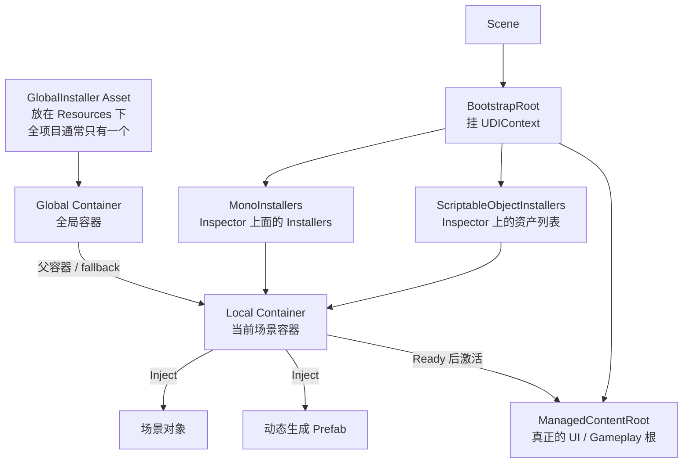
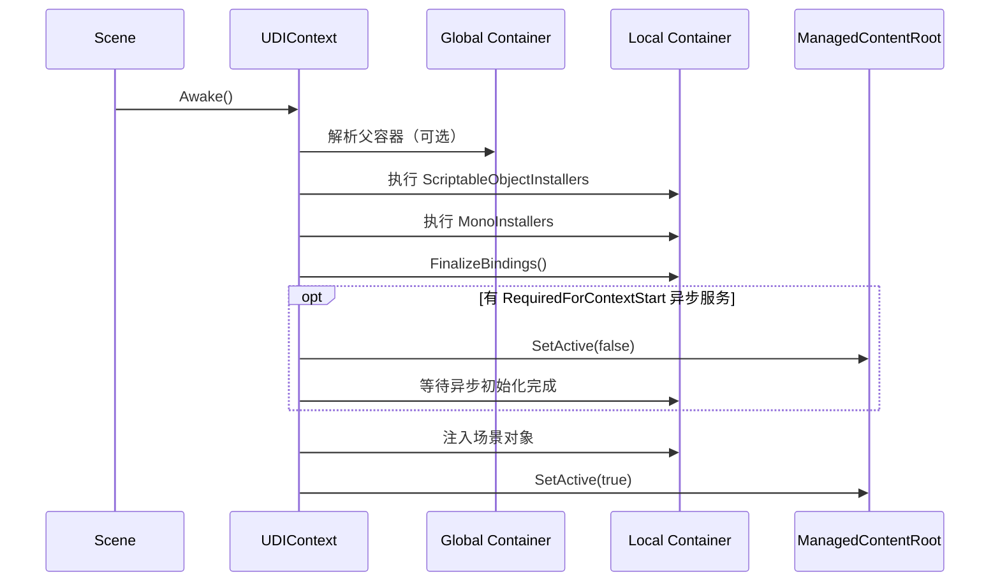
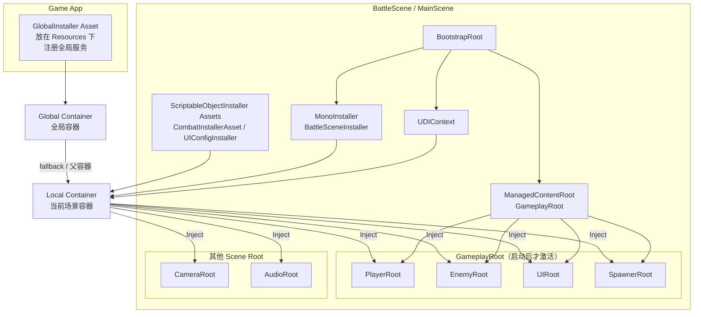
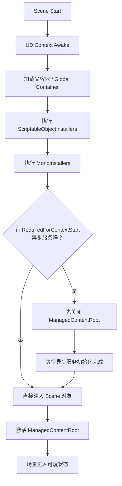

#  如何使用Installers

- `GlobalInstaller`：给**整个游戏**准备“全局兜底服务”
- `MonoInstaller`：给**当前场景**准备“场景专属服务”
- `ScriptableObjectInstaller`：给**当前场景**准备“可复用的资产型配置/服务”
- `ManagedContentRoot`：等依赖都准备好后，再把**真正内容树**打开

**关系图**



**启动时序**


**每一种怎么用**

- **`MonoInstaller`**
  - 适合：当前场景专用、需要拖场景对象引用
  - 例子：主摄像机、当前场景 UI Root、Boss 出生点、关卡配置引用
```csharp
public class BattleSceneInstaller : MonoInstaller
{
    [SerializeField] private Camera sceneCamera;
    [SerializeField] private BattleUIRoot uiRoot;

    public override void InstallBindings(UDIContainer container)
    {
        container.Bind<Camera>()
            .FromInstance(sceneCamera)
            .AsSingle();

        container.Bind<BattleUIRoot>()
            .FromInstance(uiRoot)
            .AsSingle();

        container.Bind<IEnemySpawner>()
            .To<EnemySpawner>()
            .AsSingle();
    }
}
```
  - 用法：把这个组件挂到带 `UDIContext` 的 `BootstrapRoot` 上，然后拖到上面的 `Installers` 槽，或者直接和 `UDIContext` 挂同一个物体

- **`ScriptableObjectInstaller`**
  - 适合：可复用、数据驱动、不依赖场景对象
  - 例子：武器平衡表、音频配置、掉落规则、数值表
```csharp
[CreateAssetMenu(menuName = "Game/Combat Installer")]
public class CombatInstallerAsset : ScriptableObjectInstaller
{
    [SerializeField] private WeaponBalanceTable balanceTable;
    [SerializeField] private AudioConfig audioConfig;

    public override void InstallBindings(UDIContainer container)
    {
        container.Bind<WeaponBalanceTable>()
            .FromInstance(balanceTable)
            .AsSingle();

        container.Bind<AudioConfig>()
            .FromInstance(audioConfig)
            .AsSingle();
    }
}
```
  - 用法：
    1. 在 Project 里创建这个 asset  
    2. 把 asset 拖到 `UDIContext > Scriptable Object Installers`
  - 理解重点：它还是**本地场景容器**的一部分，不是全局容器

- **`GlobalInstaller`**
  - 适合：跨场景通用、全局兜底服务
  - 例子：存档、时钟、日志、账号、平台服务
```csharp
[CreateAssetMenu(menuName = "UTools/Global Installer")]
public class GameGlobalInstaller : GlobalInstaller
{
    public override void InstallBindings(UDIContainer container)
    {
        container.Bind<ISaveService>()
            .To<SaveService>()
            .AsSingle()
            .AsGlobal();

        container.Bind<IClock>()
            .To<SystemClock>()
            .AsSingle()
            .AsGlobal();
    }
}
```
  - 用法：
    1. 创建一个 `GlobalInstaller` 资产
    2. 放到任意 `Resources` 目录下
    3. 运行时自动加载
  - 注意：
    - 通常只保留一个
    - 本地 scene 里如果又绑定了同类型服务，**本地优先，全局兜底**

- **`ManagedContentRoot`**
  - 适合：场景启动前要等异步依赖准备好的情况
  - 例子：先加载远程配置、存档、热更新表，再打开主 UI 或玩法树
```csharp
public class RemoteConfigInstaller : MonoInstaller
{
    [SerializeField] private RemoteConfigService service;

    public override void InstallBindings(UDIContainer container)
    {
        container.Bind<RemoteConfigService>()
            .FromInstance(service)
            .AsSingle()
            .RequiredForContextStart();
    }
}
```
  - 场景结构示意：
```text
BootstrapRoot
├── UDIContext
├── BattleSceneInstaller
└── GameplayRoot   <-- 拖到 ManagedContentRoot
```
  - 效果：
    - `GameplayRoot` 会先保持关闭
    - `RemoteConfigService.InitializeAsync()` 完成后才打开
    - 这样 `GameplayRoot` 下面的 UI / 玩家 / 关卡逻辑不会过早 `Awake`

**最推荐的搭法**
- **小项目 / 单场景原型**
  - 只用 `UDIContext + MonoInstaller`
- **中型项目 / 多场景**
  - `GlobalInstaller` 放跨场景服务
  - 每个 scene 一个 `UDIContext`
  - scene 专属内容放 `MonoInstaller`
  - 可复用配置放 `ScriptableObjectInstaller`
- **有异步启动流程**
  - 再加 `ManagedContentRoot`

**总结**

- 需要拖场景对象引用 → 用 `MonoInstaller`
- 需要做成可复用 asset → 用 `ScriptableObjectInstaller`
- 需要跨场景全局可用 → 用 `GlobalInstaller`
- 需要“等初始化完再开场” → 用 `ManagedContentRoot`

**对应项目实现**
- `UDIContext` 初始化流程：`D:\Projects-Personal\UTools\Assets\UTools\Scripts\UDI\UDIContext.cs:63`
- `ManagedContentRoot` 处理：`D:\Projects-Personal\UTools\Assets\UTools\Scripts\UDI\UDIContext.cs:284`
- 全局 installer 自动加载：`D:\Projects-Personal\UTools\Assets\UTools\Scripts\UDI\UDIGlobalRuntime.cs:70`
- 官方说明：`D:\Projects-Personal\UTools\Assets\UTools\Documentation~\README.md:12`
- 你的本地 installer 示例：`D:\Projects-Personal\UTools\Assets\DevTest\UDI\GameInstaller.cs:6`
- 你的全局 installer 示例：`D:\Projects-Personal\UTools\Assets\DevTest\UDI\GameGlobalInstaller.cs:7`

 

# 推荐场景层级图



**你可以这样理解**
- `GlobalInstaller`
  - 放“全游戏通用”的服务
  - 例如：`SaveService`、`LogService`、`ClockService`
- `MonoInstaller`
  - 放“这个场景特有”的服务
  - 例如：`BattleUIRoot`、`SceneCamera`、`EnemySpawner`
- `ScriptableObjectInstaller`
  - 放“可复用配置型”的服务或数据
  - 例如：`WeaponBalanceTable`、`AudioConfig`、`DropRuleTable`
- `ManagedContentRoot`
  - 放“必须等依赖准备好后才能启动”的内容树
  - 例如：`GameplayRoot`、`UIRoot`

**启动流程图**


**一个具体例子**

- **`GlobalInstaller`**
```csharp
[CreateAssetMenu(menuName = "UTools/Global Installer")]
public class GameGlobalInstaller : GlobalInstaller
{
    public override void InstallBindings(UDIContainer container)
    {
        container.Bind<ILogService>().To<LogService>().AsSingle().AsGlobal();
        container.Bind<ISaveService>().To<SaveService>().AsSingle().AsGlobal();
    }
}
```

- **`MonoInstaller`**
```csharp
public class BattleSceneInstaller : MonoInstaller
{
    [SerializeField] private Camera sceneCamera;
    [SerializeField] private BattleUIRoot battleUIRoot;

    public override void InstallBindings(UDIContainer container)
    {
        container.Bind<Camera>().FromInstance(sceneCamera).AsSingle();
        container.Bind<BattleUIRoot>().FromInstance(battleUIRoot).AsSingle();
        container.Bind<EnemySpawner>().ToSelf().AsSingle();
    }
}
```

- **`ScriptableObjectInstaller`**
```csharp
[CreateAssetMenu(menuName = "Game/Combat Installer")]
public class CombatInstallerAsset : ScriptableObjectInstaller
{
    [SerializeField] private WeaponBalanceTable weaponBalance;
    [SerializeField] private DropRuleTable dropRules;

    public override void InstallBindings(UDIContainer container)
    {
        container.Bind<WeaponBalanceTable>().FromInstance(weaponBalance).AsSingle();
        container.Bind<DropRuleTable>().FromInstance(dropRules).AsSingle();
    }
}
```

- **`ManagedContentRoot` 对应的异步初始化**
```csharp
public class RemoteConfigInstaller : MonoInstaller
{
    [SerializeField] private RemoteConfigService service;

    public override void InstallBindings(UDIContainer container)
    {
        container.Bind<RemoteConfigService>()
            .FromInstance(service)
            .AsSingle()
            .RequiredForContextStart();
    }
}
```

**Inspector 里怎么拖**
- `Installers`
  - 拖 `BattleSceneInstaller` 这种挂在场景物体上的组件
- `Scriptable Object Installers`
  - 拖 `CombatInstallerAsset` 这种 Project 面板里的 asset
- `Managed Content Root`
  - 拖 `GameplayRoot` 这个场景里的根节点

**最小推荐结构**
```text
BootstrapRoot
├── UDIContext
├── BattleSceneInstaller
└── GameplayRoot   <- 拖到 ManagedContentRoot
    ├── PlayerRoot
    ├── EnemyRoot
    ├── UIRoot
    └── SpawnerRoot
```

**什么时候不要复杂化**
- 只是小 demo：
  - 只用 `UDIContext + MonoInstaller`
- 做到多个场景、配置越来越多时：
  - 再加 `ScriptableObjectInstaller`
- 确实需要跨场景共享：
  - 再加 `GlobalInstaller`
- 确实有异步准备阶段：
  - 再用 `ManagedContentRoot`
