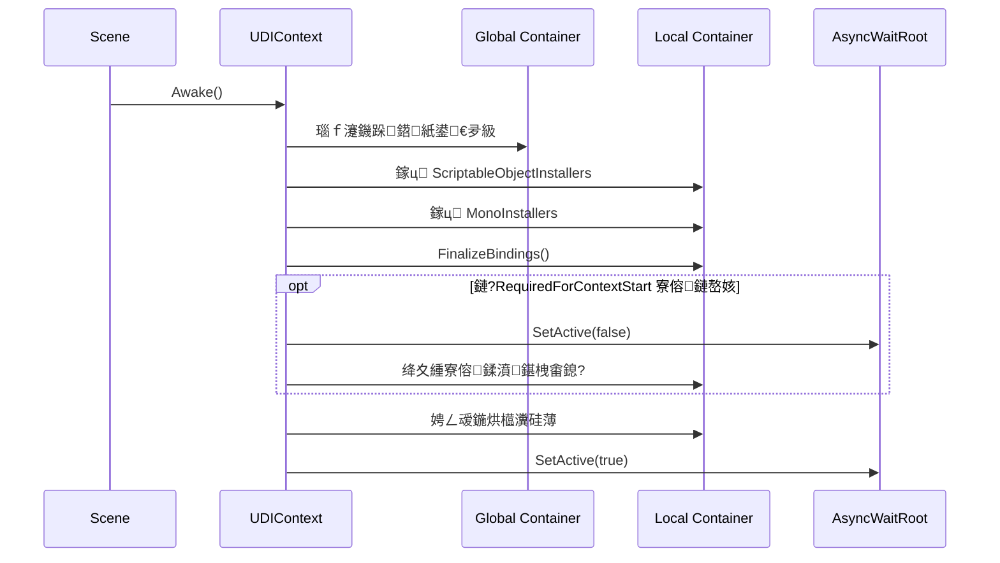

#  濡備綍浣跨敤Installers

- `GlobalInstaller`锛氱粰**鏁翠釜娓告垙**鍑嗗鈥滃叏灞€鍏滃簳鏈嶅姟鈥?
- `MonoInstaller`锛氱粰**褰撳墠鍦烘櫙**鍑嗗鈥滃満鏅笓灞炴湇鍔♀€?
- `ScriptableObjectInstaller`锛氱粰**褰撳墠鍦烘櫙**鍑嗗鈥滃彲澶嶇敤鐨勮祫浜у瀷閰嶇疆/鏈嶅姟鈥?
- `AsyncWaitRoot`锛氱瓑渚濊禆閮藉噯澶囧ソ鍚庯紝鍐嶆妸**鐪熸鍐呭鏍?*鎵撳紑

**鍏崇郴鍥?*

```mermaid
flowchart TD
    GI["GlobalInstaller Asset<br/>鏀惧湪 Resources 涓?br/>鍏ㄩ」鐩€氬父鍙湁涓€涓?] --> GC["Global Container<br/>鍏ㄥ眬瀹瑰櫒"]

    Scene["Scene"] --> Boot["BootstrapRoot<br/>鎸?UDIContext"]
    Boot --> MI["MonoInstallers<br/>Inspector 涓婇潰鐨?Installers"]
    Boot --> SOI["ScriptableObjectInstallers<br/>Inspector 涓婄殑璧勪骇鍒楄〃"]
    Boot --> MCR["AsyncWaitRoot<br/>鐪熸鐨?UI / Gameplay 鏍?]

    MI --> LC["Local Container<br/>褰撳墠鍦烘櫙瀹瑰櫒"]
    SOI --> LC
    GC -->|"鐖跺鍣?/ fallback"| LC

    LC -->|"Inject"| SceneObjs["鍦烘櫙瀵硅薄"]
    LC -->|"Inject"| Spawned["鍔ㄦ€佺敓鎴?Prefab"]
    LC -->|"Ready 鍚庢縺娲?| MCR
```

**鍚姩鏃跺簭**


**姣忎竴绉嶆€庝箞鐢?*

- **`MonoInstaller`**
  - 閫傚悎锛氬綋鍓嶅満鏅笓鐢ㄣ€侀渶瑕佹嫋鍦烘櫙瀵硅薄寮曠敤
  - 渚嬪瓙锛氫富鎽勫儚鏈恒€佸綋鍓嶅満鏅?UI Root銆丅oss 鍑虹敓鐐广€佸叧鍗￠厤缃紩鐢?
```csharp
public class BattleSceneInstaller : MonoInstaller
{
    [SerializeField] private Camera sceneCamera;
    [SerializeField] private BattleUIRoot uiRoot;

    public override void InstallBindings(UDIContainer container)
    {
        container.Bind<Camera>()
            .FromInstance(sceneCamera)
            .AsSingle();

        container.Bind<BattleUIRoot>()
            .FromInstance(uiRoot)
            .AsSingle();

        container.Bind<IEnemySpawner>()
            .To<EnemySpawner>()
            .AsSingle();
    }
}
```
  - 鐢ㄦ硶锛氭妸杩欎釜缁勪欢鎸傚埌甯?`UDIContext` 鐨?`BootstrapRoot` 涓婏紝鐒跺悗鎷栧埌涓婇潰鐨?`Installers` 妲斤紝鎴栬€呯洿鎺ュ拰 `UDIContext` 鎸傚悓涓€涓墿浣?

- **`ScriptableObjectInstaller`**
  - 閫傚悎锛氬彲澶嶇敤銆佹暟鎹┍鍔ㄣ€佷笉渚濊禆鍦烘櫙瀵硅薄
  - 渚嬪瓙锛氭鍣ㄥ钩琛¤〃銆侀煶棰戦厤缃€佹帀钀借鍒欍€佹暟鍊艰〃
```csharp
[CreateAssetMenu(menuName = "Game/Combat Installer")]
public class CombatInstallerAsset : ScriptableObjectInstaller
{
    [SerializeField] private WeaponBalanceTable balanceTable;
    [SerializeField] private AudioConfig audioConfig;

    public override void InstallBindings(UDIContainer container)
    {
        container.Bind<WeaponBalanceTable>()
            .FromInstance(balanceTable)
            .AsSingle();

        container.Bind<AudioConfig>()
            .FromInstance(audioConfig)
            .AsSingle();
    }
}
```
  - 鐢ㄦ硶锛?
    1. 鍦?Project 閲屽垱寤鸿繖涓?asset  
    2. 鎶?asset 鎷栧埌 `UDIContext > Scriptable Object Installers`
  - 鐞嗚В閲嶇偣锛氬畠杩樻槸**鏈湴鍦烘櫙瀹瑰櫒**鐨勪竴閮ㄥ垎锛屼笉鏄叏灞€瀹瑰櫒

- **`GlobalInstaller`**
  - 閫傚悎锛氳法鍦烘櫙閫氱敤銆佸叏灞€鍏滃簳鏈嶅姟
  - 渚嬪瓙锛氬瓨妗ｃ€佹椂閽熴€佹棩蹇椼€佽处鍙枫€佸钩鍙版湇鍔?
```csharp
[CreateAssetMenu(menuName = "UTools/Global Installer")]
public class GameGlobalInstaller : GlobalInstaller
{
    public override void InstallBindings(UDIContainer container)
    {
        container.Bind<ISaveService>()
            .To<SaveService>()
            .AsSingle()
            .AsGlobal();

        container.Bind<IClock>()
            .To<SystemClock>()
            .AsSingle()
            .AsGlobal();
    }
}
```
  - 鐢ㄦ硶锛?
    1. 鍒涘缓涓€涓?`GlobalInstaller` 璧勪骇
    2. 鏀惧埌浠绘剰 `Resources` 鐩綍涓?
    3. 杩愯鏃惰嚜鍔ㄥ姞杞?
  - 娉ㄦ剰锛?
    - 閫氬父鍙繚鐣欎竴涓?
    - 鏈湴 scene 閲屽鏋滃張缁戝畾浜嗗悓绫诲瀷鏈嶅姟锛?*鏈湴浼樺厛锛屽叏灞€鍏滃簳**

- **`AsyncWaitRoot`**
  - 閫傚悎锛氬満鏅惎鍔ㄥ墠瑕佺瓑寮傛渚濊禆鍑嗗濂界殑鎯呭喌
  - 渚嬪瓙锛氬厛鍔犺浇杩滅▼閰嶇疆銆佸瓨妗ｃ€佺儹鏇存柊琛紝鍐嶆墦寮€涓?UI 鎴栫帺娉曟爲
```csharp
public class RemoteConfigInstaller : MonoInstaller
{
    [SerializeField] private RemoteConfigService service;

    public override void InstallBindings(UDIContainer container)
    {
        container.Bind<RemoteConfigService>()
            .FromInstance(service)
            .AsSingle()
            .RequiredForContextStart();
    }
}
```
  - 鍦烘櫙缁撴瀯绀烘剰锛?
```text
BootstrapRoot
鈹溾攢鈹€ UDIContext
鈹溾攢鈹€ BattleSceneInstaller
鈹斺攢鈹€ GameplayRoot   <-- 鎷栧埌 AsyncWaitRoot
```
  - 鏁堟灉锛?
    - `GameplayRoot` 浼氬厛淇濇寔鍏抽棴
    - `RemoteConfigService.InitializeAsync()` 瀹屾垚鍚庢墠鎵撳紑
    - 杩欐牱 `GameplayRoot` 涓嬮潰鐨?UI / 鐜╁ / 鍏冲崱閫昏緫涓嶄細杩囨棭 `Awake`

**鏈€鎺ㄨ崘鐨勬惌娉?*
- **灏忛」鐩?/ 鍗曞満鏅師鍨?*
  - 鍙敤 `UDIContext + MonoInstaller`
- **涓瀷椤圭洰 / 澶氬満鏅?*
  - `GlobalInstaller` 鏀捐法鍦烘櫙鏈嶅姟
  - 姣忎釜 scene 涓€涓?`UDIContext`
  - scene 涓撳睘鍐呭鏀?`MonoInstaller`
  - 鍙鐢ㄩ厤缃斁 `ScriptableObjectInstaller`
- **鏈夊紓姝ュ惎鍔ㄦ祦绋?*
  - 鍐嶅姞 `AsyncWaitRoot`

**鎬荤粨**

- 闇€瑕佹嫋鍦烘櫙瀵硅薄寮曠敤 鈫?鐢?`MonoInstaller`
- 闇€瑕佸仛鎴愬彲澶嶇敤 asset 鈫?鐢?`ScriptableObjectInstaller`
- 闇€瑕佽法鍦烘櫙鍏ㄥ眬鍙敤 鈫?鐢?`GlobalInstaller`
- 闇€瑕佲€滅瓑鍒濆鍖栧畬鍐嶅紑鍦衡€?鈫?鐢?`AsyncWaitRoot`

**瀵瑰簲椤圭洰瀹炵幇**
- `UDIContext` 鍒濆鍖栨祦绋嬶細`D:\Projects-Personal\UTools\Assets\UTools\Scripts\UDI\UDIContext.cs:63`
- `AsyncWaitRoot` 澶勭悊锛歚D:\Projects-Personal\UTools\Assets\UTools\Scripts\UDI\UDIContext.cs:284`
- 鍏ㄥ眬 installer 鑷姩鍔犺浇锛歚D:\Projects-Personal\UTools\Assets\UTools\Scripts\UDI\UDIGlobalRuntime.cs:70`
- 瀹樻柟璇存槑锛歚D:\Projects-Personal\UTools\Assets\UTools\Documentation~\README.md:12`
- 浣犵殑鏈湴 installer 绀轰緥锛歚D:\Projects-Personal\UTools\Assets\DevTest\UDI\GameInstaller.cs:6`
- 浣犵殑鍏ㄥ眬 installer 绀轰緥锛歚D:\Projects-Personal\UTools\Assets\DevTest\UDI\GameGlobalInstaller.cs:7`

 

# 鎺ㄨ崘鍦烘櫙灞傜骇鍥?

```mermaid
flowchart TD
    subgraph App["Game App"]
        GI["GlobalInstaller Asset<br/>鏀惧湪 Resources 涓?br/>娉ㄥ唽鍏ㄥ眬鏈嶅姟"]
    end

    GI --> GC["Global Container<br/>鍏ㄥ眬瀹瑰櫒"]

    subgraph Scene["BattleScene / MainScene"]
        Boot["BootstrapRoot"]
        Ctx["UDIContext"]
        MI["MonoInstaller<br/>BattleSceneInstaller"]
        SOI["ScriptableObjectInstaller Assets<br/>CombatInstallerAsset / UIConfigInstaller"]
        MCR["AsyncWaitRoot<br/>GameplayRoot"]

        Boot --> Ctx
        Boot --> MI
        Boot --> MCR

        subgraph Managed["GameplayRoot锛堝惎鍔ㄥ悗鎵嶆縺娲伙級"]
            Player["PlayerRoot"]
            Enemies["EnemyRoot"]
            UI["UIRoot"]
            Spawner["SpawnerRoot"]
        end

        subgraph Other["鍏朵粬 Scene Root"]
            Camera["CameraRoot"]
            Audio["AudioRoot"]
        end

        MCR --> Player
        MCR --> Enemies
        MCR --> UI
        MCR --> Spawner
    end

    Ctx --> LC["Local Container<br/>褰撳墠鍦烘櫙瀹瑰櫒"]
    MI --> LC
    SOI --> LC
    GC -->|"fallback / 鐖跺鍣?| LC

    LC -->|"Inject"| Player
    LC -->|"Inject"| Enemies
    LC -->|"Inject"| UI
    LC -->|"Inject"| Spawner
    LC -->|"Inject"| Camera
    LC -->|"Inject"| Audio
```

**浣犲彲浠ヨ繖鏍风悊瑙?*
- `GlobalInstaller`
  - 鏀锯€滃叏娓告垙閫氱敤鈥濈殑鏈嶅姟
  - 渚嬪锛歚SaveService`銆乣LogService`銆乣ClockService`
- `MonoInstaller`
  - 鏀锯€滆繖涓満鏅壒鏈夆€濈殑鏈嶅姟
  - 渚嬪锛歚BattleUIRoot`銆乣SceneCamera`銆乣EnemySpawner`
- `ScriptableObjectInstaller`
  - 鏀锯€滃彲澶嶇敤閰嶇疆鍨嬧€濈殑鏈嶅姟鎴栨暟鎹?
  - 渚嬪锛歚WeaponBalanceTable`銆乣AudioConfig`銆乣DropRuleTable`
- `AsyncWaitRoot`
  - 鏀锯€滃繀椤荤瓑渚濊禆鍑嗗濂藉悗鎵嶈兘鍚姩鈥濈殑鍐呭鏍?
  - 渚嬪锛歚GameplayRoot`銆乣UIRoot`

**鍚姩娴佺▼鍥?*
```mermaid
flowchart TD
    A["Scene Start"] --> B["UDIContext Awake"]
    B --> C["鍔犺浇鐖跺鍣?/ Global Container"]
    C --> D["鎵ц ScriptableObjectInstallers"]
    D --> E["鎵ц MonoInstallers"]
    E --> F{"鏈?RequiredForContextStart<br/>寮傛鏈嶅姟鍚楋紵"}

    F -- 鍚?--> G["鐩存帴娉ㄥ叆 Scene 瀵硅薄"]
    F -- 鏄?--> H["鍏堝叧闂?AsyncWaitRoot"]
    H --> I["绛夊緟寮傛鏈嶅姟鍒濆鍖栧畬鎴?]
    I --> G

    G --> J["婵€娲?AsyncWaitRoot"]
    J --> K["鍦烘櫙杩涘叆鍙帺鐘舵€?]
```

**涓€涓叿浣撲緥瀛?*

- **`GlobalInstaller`**
```csharp
[CreateAssetMenu(menuName = "UTools/Global Installer")]
public class GameGlobalInstaller : GlobalInstaller
{
    public override void InstallBindings(UDIContainer container)
    {
        container.Bind<ILogService>().To<LogService>().AsSingle().AsGlobal();
        container.Bind<ISaveService>().To<SaveService>().AsSingle().AsGlobal();
    }
}
```

- **`MonoInstaller`**
```csharp
public class BattleSceneInstaller : MonoInstaller
{
    [SerializeField] private Camera sceneCamera;
    [SerializeField] private BattleUIRoot battleUIRoot;

    public override void InstallBindings(UDIContainer container)
    {
        container.Bind<Camera>().FromInstance(sceneCamera).AsSingle();
        container.Bind<BattleUIRoot>().FromInstance(battleUIRoot).AsSingle();
        container.Bind<EnemySpawner>().ToSelf().AsSingle();
    }
}
```

- **`ScriptableObjectInstaller`**
```csharp
[CreateAssetMenu(menuName = "Game/Combat Installer")]
public class CombatInstallerAsset : ScriptableObjectInstaller
{
    [SerializeField] private WeaponBalanceTable weaponBalance;
    [SerializeField] private DropRuleTable dropRules;

    public override void InstallBindings(UDIContainer container)
    {
        container.Bind<WeaponBalanceTable>().FromInstance(weaponBalance).AsSingle();
        container.Bind<DropRuleTable>().FromInstance(dropRules).AsSingle();
    }
}
```

- **`AsyncWaitRoot` 瀵瑰簲鐨勫紓姝ュ垵濮嬪寲**
```csharp
public class RemoteConfigInstaller : MonoInstaller
{
    [SerializeField] private RemoteConfigService service;

    public override void InstallBindings(UDIContainer container)
    {
        container.Bind<RemoteConfigService>()
            .FromInstance(service)
            .AsSingle()
            .RequiredForContextStart();
    }
}
```

**Inspector 閲屾€庝箞鎷?*
- `Installers`
  - 鎷?`BattleSceneInstaller` 杩欑鎸傚湪鍦烘櫙鐗╀綋涓婄殑缁勪欢
- `Scriptable Object Installers`
  - 鎷?`CombatInstallerAsset` 杩欑 Project 闈㈡澘閲岀殑 asset
- `Managed Content Root`
  - 鎷?`GameplayRoot` 杩欎釜鍦烘櫙閲岀殑鏍硅妭鐐?

**鏈€灏忔帹鑽愮粨鏋?*
```text
BootstrapRoot
鈹溾攢鈹€ UDIContext
鈹溾攢鈹€ BattleSceneInstaller
鈹斺攢鈹€ GameplayRoot   <- 鎷栧埌 AsyncWaitRoot
    鈹溾攢鈹€ PlayerRoot
    鈹溾攢鈹€ EnemyRoot
    鈹溾攢鈹€ UIRoot
    鈹斺攢鈹€ SpawnerRoot
```

**浠€涔堟椂鍊欎笉瑕佸鏉傚寲**
- 鍙槸灏?demo锛?
  - 鍙敤 `UDIContext + MonoInstaller`
- 鍋氬埌澶氫釜鍦烘櫙銆侀厤缃秺鏉ヨ秺澶氭椂锛?
  - 鍐嶅姞 `ScriptableObjectInstaller`
- 纭疄闇€瑕佽法鍦烘櫙鍏变韩锛?
  - 鍐嶅姞 `GlobalInstaller`
- 纭疄鏈夊紓姝ュ噯澶囬樁娈碉細
  - 鍐嶇敤 `AsyncWaitRoot`

